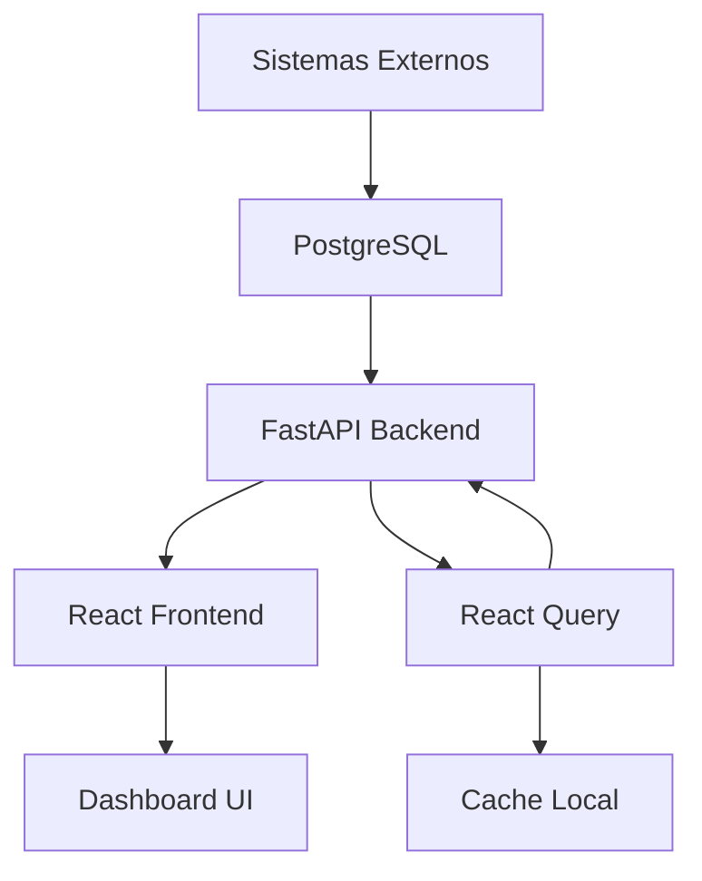

# Dashboard KPI Diário - Documentação Técnica

## 📋 Visão Geral

O **Dashboard KPI Diário** é um sistema de monitoramento em tempo real que consolida métricas de diferentes ferramentas e sistemas utilizados pela organização. O sistema é composto por um frontend em React com TypeScript e um backend em FastAPI com Python.

## 🏗️ Arquitetura do Sistema

```
┌─────────────────┐    ┌─────────────────┐    ┌─────────────────┐
│   Frontend      │    │    Backend      │    │   PostgreSQL    │
│   React + Vite  │◄──►│    FastAPI      │◄──►│   Database      │
│   TypeScript    │    │    Python       │    │                 │
└─────────────────┘    └─────────────────┘    └─────────────────┘
```

## 🚀 Tecnologias Utilizadas

### Frontend

- **React 18.2.0** - Biblioteca para interfaces de usuário
- **TypeScript 5.2.2** - Superset tipado do JavaScript
- **Vite 5.0.0** - Build tool e dev server
- **Tailwind CSS 3.3.5** - Framework CSS utilitário
- **Framer Motion 12.23.12** - Animações e transições
- **React Router DOM 7.8.2** - Roteamento SPA
- **TanStack Query 5.8.0** - Gerenciamento de estado server
- **Recharts 2.8.0** - Biblioteca de gráficos
- **Axios 1.6.0** - Cliente HTTP

### Backend

- **FastAPI** - Framework web moderno para APIs
- **Python 3.13+** - Linguagem de programação
- **psycopg[binary,pool]** - Driver PostgreSQL com pool de conexões
- **uvicorn** - Servidor ASGI

### Banco de Dados

- **PostgreSQL** - Sistema de gerenciamento de banco de dados

## 📁 Estrutura do Projeto

```
bo-dashboard/
├── backend/                     # API Backend
│   ├── main.py                 # Aplicação FastAPI principal
│   ├── config.py              # Configurações do banco
│   ├── requirements.txt       # Dependências Python
│   └── test_*.py             # Testes de conectividade
├── src/                       # Frontend React
│   ├── components/           # Componentes reutilizáveis
│   │   ├── KpiCard.tsx      # Card de KPIs com gráfico
│   │   └── StatusBar.tsx    # Barra de status do sistema
│   ├── pages/               # Páginas da aplicação
│   │   ├── EvolutionDetail.tsx    # Detalhes Evolution
│   │   ├── GoogleAdsDetail.tsx    # Detalhes Google Ads
│   │   ├── MetaAdsDetail.tsx     # Detalhes Meta Ads
│   │   ├── N8nDetail.tsx         # Detalhes N8N
│   │   └── PiperunDetail.tsx     # Detalhes PipeRun
│   ├── lib/                # Utilitários e configurações
│   │   ├── api.ts          # Cliente HTTP e endpoints
│   │   ├── format.ts       # Formatação de números/moeda
│   │   └── systems.ts      # Configuração dos sistemas
│   ├── App.tsx             # Componente principal
│   ├── main.tsx           # Ponto de entrada React
│   ├── index.css          # Estilos globais
│   └── types.ts           # Definições TypeScript
├── docker-compose.yml      # Orchestração Docker
├── Dockerfile             # Imagem Docker frontend
├── package.json           # Dependências Node.js
└── vite.config.ts        # Configuração Vite
```

## 🔧 Sistemas Integrados

O dashboard monitora os seguintes sistemas:

### 1. **Meta Ads** 📢

- **Métricas**: Custo, Leads, Cliques, CPL, CPC
- **Funcionalidade**: Campanhas publicitárias Facebook/Instagram
- **Agregação**: Soma para métricas absolutas, média para CPL/CPC

### 2. **Google Ads** 🔍

- **Métricas**: Custo, Leads, Cliques, CPL, CPC
- **Funcionalidade**: Campanhas publicitárias Google
- **Agregação**: Soma para métricas absolutas, média para CPL/CPC

### 3. **PipeRun** 📊

- **Métricas**: Oportunidades Recebidas, Ganhas, Perdidas
- **Funcionalidade**: CRM e pipeline de vendas
- **Filtro**: Pipeline específico (ID: 78157)

### 4. **N8N** 🔄

- **Métricas**: Total de Fluxos, Execuções Bem-sucedidas, Falhas, Duração Média
- **Funcionalidade**: Automação de processos
- **Filtro**: Workspace específico (ID: HJDfVFxTb7w1KNDD)

### 5. **Conta Azul** 💰

- **Métricas**: Clientes Novos, A Receber Total, Recebidas Total
- **Funcionalidade**: Sistema financeiro
- **Agregação**: Soma de todas as métricas

### 6. **CPJ-3C** ⚖️

- **Métricas**: Audiências, Perícias, Processos
- **Funcionalidade**: Sistema jurídico
- **Agregação**: Soma de todas as métricas

### 7. **Evolution** 📱

- **Métricas**: Instâncias, Mensagens Enviadas, Tempo Resposta, Não Lidas
- **Funcionalidade**: Sistema de mensageria WhatsApp
- **Agregação**: Soma e médias conforme o tipo de métrica

## 🌐 API Endpoints

### Base URL

```
http://127.0.0.1:8002 (desenvolvimento)
```

### Endpoints Principais

#### 1. **Health Check**

```http
GET /health
```

Verifica se a API está funcionando.

#### 2. **KPIs do Dia**

```http
GET /kpis/{system}
```

Retorna as métricas do dia atual para um sistema específico.

**Parâmetros:**

- `system`: `meta_ads`, `google_ads`, `piperun`, `n8n`, `conta_azul`, `cpj3c`, `evolution`

**Resposta:**

```json
{
  "values": [100, 50, 25, 2.5, 1.5],
  "updated_at": "2025-08-29T10:30:00Z"
}
```

#### 3. **Série Temporal**

```http
GET /series/{system}
```

Retorna dados dos últimos 30 dias para gráficos.

**Resposta:**

```json
{
  "points": [
    { "x": "2025-08-01", "y": 100 },
    { "x": "2025-08-02", "y": 120 }
  ]
}
```

#### 4. **Dados Detalhados**

```http
GET /detailed/{system}
```

Retorna todos os registros detalhados de um sistema.

## 🎨 Interface do Usuário

### Dashboard Principal (`/`)

- **Layout**: Grid responsivo com cards de KPIs
- **Conteúdo**: Visão geral de todos os sistemas
- **Atualização**: Automática a cada 2 minutos
- **Funcionalidades**:
  - Cards animados com hover effects
  - Gráficos em tempo real
  - Status de conectividade
  - Links para páginas detalhadas

### Páginas de Detalhes

- **Rota**: `/{system}-detail`
- **Conteúdo**: Análise aprofundada de cada sistema
- **Recursos**:
  - Gráficos múltiplos (barras e linhas)
  - Tabelas de registros recentes
  - Filtros por período/campanha
  - Métricas agregadas

## 🔄 Fluxo de Dados



1. **Coleta**: Dados são coletados dos sistemas externos
2. **Armazenamento**: Salvos no PostgreSQL com schema `kpi_tv`
3. **API**: FastAPI processa e serve os dados
4. **Cache**: TanStack Query cacheia as respostas
5. **Interface**: React renderiza os componentes

## ⚙️ Configuração e Instalação

### Pré-requisitos

- Node.js 18+
- Python 3.13+
- PostgreSQL 12+
- Git

### Backend Setup

```bash
cd backend
pip install -r requirements.txt
python -m uvicorn main:app --host 127.0.0.1 --port 8002 --reload
```

### Frontend Setup

```bash
npm install
npm run dev
```

### Variáveis de Ambiente

#### Backend (`config.py`)

```python
DB_HOST = "134.255.182.159"
DB_PORT = 5432
DB_NAME = "dashboard-diario"
DB_USER = "postgres"
DB_PASSWORD = "mkt2024"
```

#### Frontend (`.env`)

```bash
VITE_API_BASE_URL=http://127.0.0.1:8002
```

## 🎯 Funcionalidades Específicas

### Responsividade

- **Desktop**: Layout completo com todas as informações
- **Tablet**: Cards reorganizados em grid adaptativo
- **Mobile**: Stack vertical com navegação simplificada
- **TV**: Fontes otimizadas para visualização à distância

### Animações

- **Framer Motion**: Transições suaves entre estados
- **Loading States**: Skeleton screens durante carregamento
- **Micro-interactions**: Hover effects e feedback visual
- **Page Transitions**: Navegação fluida entre páginas

### Cache e Performance

- **TanStack Query**: Cache inteligente de requisições
- **Invalidação**: Refetch automático em intervalos configuráveis
- **Otimização**: Lazy loading e code splitting
- **Minimização**: Bundle otimizado para produção

## 📊 Métricas e Monitoramento

### KPIs Principais por Sistema

#### Meta Ads & Google Ads

- **Custo**: Valor total gasto em campanhas (R$)
- **Leads**: Número total de leads gerados
- **Cliques**: Total de cliques nos anúncios
- **CPL**: Custo por Lead (média simples)
- **CPC**: Custo por Clique (média simples)

#### PipeRun

- **Recebidas**: Oportunidades que entraram no funil
- **Ganhas**: Oportunidades convertidas em vendas
- **Perdidas**: Oportunidades que não se converteram

#### N8N

- **Fluxos**: Total de fluxos de automação ativos
- **Sucesso**: Execuções bem-sucedidas
- **Falhas**: Execuções que falharam
- **AVG**: Tempo médio de execução (segundos)

### Cálculos Especiais

#### CPL e CPC (Meta/Google Ads)

```typescript
// Média simples dos registros do dia
const avgCPL = kpiData.countCPL > 0 ? kpiData.sumCPL / kpiData.countCPL : 0;
const avgCPC = kpiData.countCPC > 0 ? kpiData.sumCPC / kpiData.countCPC : 0;
```

#### Formatação de Valores

```typescript
// Moeda brasileira
export const fmtMoney = (value: number | null): string => {
  if (value === null || value === undefined) return "R$ 0,00";
  return new Intl.NumberFormat("pt-BR", {
    style: "currency",
    currency: "BRL",
  }).format(value);
};

// Números com separadores
export const fmtNum = (value: number | null): string => {
  if (value === null || value === undefined) return "0";
  return new Intl.NumberFormat("pt-BR").format(value);
};
```

## 🔒 Segurança e CORS

### Configuração CORS

```python
app.add_middleware(
    CORSMiddleware,
    allow_origins=["*"],  # Produção: especificar domínios
    allow_credentials=True,
    allow_methods=["*"],
    allow_headers=["*"],
)
```

### Pool de Conexões

```python
pool = psycopg_pool.ConnectionPool(
    DATABASE_URL,
    min_size=1,
    max_size=5,
    timeout=5
)
```

## 🚀 Deploy e Produção

### Docker

```yaml
# docker-compose.yml
services:
  frontend:
    build: .
    ports:
      - "1633:1633"
    environment:
      - VITE_API_BASE_URL=http://dashboardkpidiarioapi.automacoesbeo.xyz
```

### Build para Produção

```bash
npm run build
npm run preview
```

## 🐛 Troubleshooting

### Problemas Comuns

#### 1. Erro de Conexão com Banco

```bash
# Verificar conectividade
python backend/test_db.py
```

#### 2. Porta em Uso

```bash
# Windows - verificar porta 8002
netstat -ano | findstr :8002

# Matar processo se necessário
taskkill /PID <PID> /F
```

#### 3. Problemas de CORS

- Verificar configuração do backend
- Confirmar URL da API no frontend

#### 4. Datas Incorretas

- Problema resolvido com formatação UTC
- Usar `new Date(date + 'T00:00:00')`

## 📈 Roadmap e Melhorias

### Funcionalidades Planejadas

- [ ] Alertas em tempo real
- [ ] Exportação de relatórios
- [ ] Dashboard personalizável
- [ ] Autenticação de usuários
- [ ] API rate limiting
- [ ] Logs de auditoria

### Otimizações Técnicas

- [ ] Server-side rendering (SSR)
- [ ] Progressive Web App (PWA)
- [ ] WebSocket para updates em tempo real
- [ ] Compressão de dados
- [ ] CDN para assets estáticos

## 👥 Desenvolvedor e Contato
- **Giulliano Veiga**: 
-    https://www.instagram.com/giullianoveiga 
-    https://www.linkedin.com/in/giulliano-veiga

### Desenvolvimento

- **Backend**: Python/FastAPI
- **Frontend**: React/TypeScript
- **Database**: PostgreSQL

### Suporte Técnico

- **Repositório**: dashboard-kpi-diario
- **Owner**: Branco-o-Oliveira-Projetos
- **Branch**: master

---

## 📝 Changelog

### v1.0.0 (Agosto 2025)

- ✅ Sistema base com 7 integrações
- ✅ Dashboard responsivo
- ✅ API RESTful completa
- ✅ Animações e transições
- ✅ Cache inteligente
- ✅ Páginas de detalhes
- ✅ Formatação de datas UTC
- ✅ Responsividade para TVs

---

_Documentação atualizada em: 29 de Agosto de 2025_
